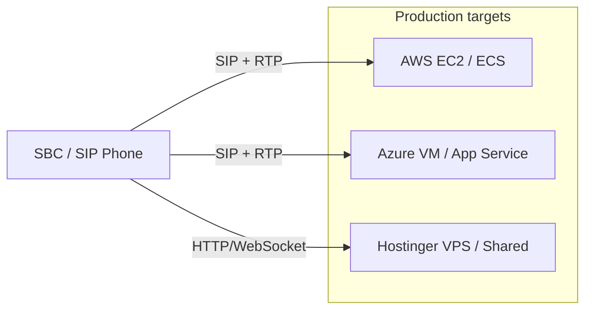
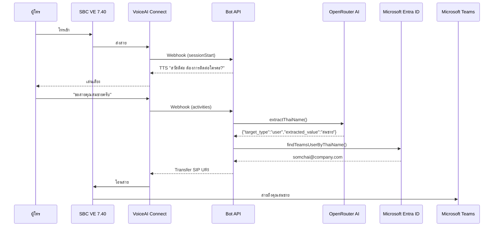

# VoiceTeam Bot — AI-Powered IVR Voice Bot

[](https://nodejs.org)
[](https://www.typescriptlang.org/)
[](https://react.dev)
[](https://tailwindcss.com)

- ระบบ IVR Voice Bot อัจฉริยะที่ใช้ AI (OpenRouter) ในการวิเคราะห์คำพูดภาษาไทย เพื่อค้นหาพนักงานจาก Microsoft Entra ID และโอนสายอัตโนมัติผ่าน AudioCodes SBC

---

## ✨ ความสามารถหลัก

| Layer | Technology | Description |
|-------|-----------|-------------|
| **IVR Bot** | Express.js | Webhook endpoint สำหรับ AudioCodes VoiceAI Connect |
| **AI Extractor** | OpenRouter AI | วิเคราะห์เจตนาผู้โทร (ชื่อคน/แผนก/เบอร์ต่อ) ด้วย GPT-5.6 Luna |
| **Directory Lookup** | Microsoft Graph API | ค้นหาพนักงานจาก Entra ID พร้อมจัดการชื่อซ้ำ |
| **Call Transfer** | SIP | สร้างคำสั่งโอนสายแบบ Blind / Consultative Transfer |
| **Admin API** | Express.js + JWT | จัดการ Config, ทดสอบ Connection, WebSocket Logs |
| **Dashboard UI** | React + Tailwind CSS | Login, Config, Monitor, Unhandled Intents, Departments |
| **MFA Login** | Microsoft Entra ID | รองรับการล็อกอินด้วย MFA ผ่าน MSAL |
| **Real-time Logs** | WebSocket | ดู Log การทำงานแบบ Real-time บน Dashboard |

---

## 📁 Project Structure

```
voice-bot-api/
├── src/
│   ├── webhook-server.ts              # Express app — จุดรวมทุกอย่าง
│   ├── config-types.ts                # AppConfig schema, defaults, maskSecrets()
│   ├── config-manager.ts              # In-memory config store (hot-reload)
│   ├── auth-jwt.ts                    # JWT sign/verify + middleware
│   ├── auth-router.ts                 # POST /api/admin/auth/login
│   ├── mfa-router.ts                  # POST /api/admin/auth/mfa-login
│   ├── admin-router.ts                # GET/POST /api/admin/config + test-connection
│   ├── ws-server.ts                   # WebSocket server สำหรับ log streaming
│   ├── system-logger.ts               # EventEmitter-based log broadcaster
│   ├── extract-name.ts                # Thai name extraction via OpenRouter AI
│   ├── graph-user.ts                  # Entra ID lookup (รองรับชื่อซ้ำ)
│   ├── department-lookup.ts           # แผนก → SIP URI mapping
│   ├── transfer.ts                    # generateTransferResponse()
│   ├── transfer-fallback.ts           # Fallback เมื่อโอนสายไม่สำเร็จ
│   ├── test-connections.ts            # ทดสอบ OpenRouter & Azure AD
│   ├── unhandled-intents.ts           # บันทึกคำพูดที่ AI แยกไม่ออก
│   ├── unhandled-router.ts            # API สำหรับ review unhandled intents
│   ├── department-router.ts           # API สำหรับจัดการแผนก
│   ├── users-router.ts                # API สำหรับจัดการผู้ใช้
│   ├── retry-counter.ts               # นับจำนวนครั้งที่โอนสายไม่สำเร็จ
│   ├── tts-cleaner.ts                 # ทำความสะอาดข้อความก่อน TTS
│   ├── cache.ts                       # TTL Cache สำหรับ Entra ID + Departments
│   ├── user-store.ts                  # อ่าน/เขียน users.json
├── sip-endpoint.ts                   # SIP Media Endpoint (TCP/UDP)
├── speech-asr.ts                     # Azure Speech-to-Text processor
│   ├── websocket/                     # Core SDK classes
│   │   ├── bot-api.ts                 # BotApiWebSocket
│   │   ├── bot-conversation.ts        # BotConversationWebSocket
│   │   └── types.ts                   # Enums & interfaces
│   └── scripts/
│       ├── hash-password.ts           # CLI สร้าง bcrypt hash
│       └── seed-users.ts              # CLI เพิ่มผู้ใช้เริ่มต้น
├── admin-dashboard/                   # React + Vite + Tailwind
│   └── src/
│       ├── App.tsx                    # Router (React Router v7)
│       ├── contexts/AuthContext.tsx    # AuthProvider + useAuth
│       ├── components/
│       │   ├── MfaLoginButton.tsx      # ปุ่ม Sign in with Microsoft (MFA)
│       │   ├── ProtectedRoute.tsx      # Route guard
│       │   ├── ConfigTab.tsx           # Tab navigation
│       │   ├── FieldGroup.tsx          # Form field wrapper
│       │   ├── Toast.tsx               # Toast notification
│       │   ├── AlertBanner.tsx         # System alert banner
│       │   ├── ConnectionTestModal.tsx # Modal ผลการทดสอบ connection
│       │   └── LiveConsoleLog.tsx      # Terminal log viewer
│       ├── pages/
│       │   ├── LoginPage.tsx           # Login (password + MFA)
│       │   ├── PortalPage.tsx          # Landing page
│       │   ├── ConfigPage.tsx          # 4-tab configuration form
│       │   ├── MonitorPage.tsx         # KPI + active calls + console
│       │   ├── DepartmentPage.tsx      # จัดการแผนก
│       │   ├── UnhandledPage.tsx       # Review unhandled intents
│       │   └── UsersPage.tsx           # จัดการผู้ใช้
│       └── hooks/useConfigApi.ts       # Fetch + save + test connections
├── config.json                         # Runtime config (ไม่ commit ขึ้น git)
├── config.example.json                 # ตัวอย่าง config สำหรับ dev
├── users.json                          # ผู้ใช้ระบบ (ไม่ commit ขึ้น git)
├── users.example.json                  # ตัวอย่าง users
├── docs/
│   └── sbc-config.md                   # คู่มือตั้งค่า SBC
└── package.json
```

---

## 🚀 Quick Start (Local Development)

### Prerequisites

- Node.js 24+
- npm

### 1. Clone & Install

```bash
git clone https://github.com/VichyaS/AI-Bot-VoiceTeam.git
cd AI-Bot-VoiceTeam

# Backend dependencies
npm install

# Frontend dependencies
cd admin-dashboard && npm install && cd ..
```

### 2. Configure

```bash
# คัดลอก config ตัวอย่าง
cp config.example.json config.json

# สร้างผู้ใช้เริ่มต้น
npm run seed-users
# หรือสร้าง hash password ด้วยตัวเอง
npm run hash-password -- "your-password"
```

### 3. Start Development

```bash
# Terminal 1: Backend (port 8081)
npm run start:dev

# Terminal 2: Frontend (port 5173)
cd admin-dashboard && npm run dev
```

เปิด `http://localhost:5173` ใน browser

---

## � Security, SIP/TLS and SRTP

This release includes stronger transport defaults for production SIP deployments:

- Optional SIP over TLS listener on port `5061` via `sipTlsEnabled` and `sipTlsPort`
- Optional SRTP advertisement in SDP via `srtpEnabled` and `srtpProfile`
- TLS certificate paths configurable through `sipTlsCertPath` and `sipTlsKeyPath`
- Azure deployment script under [deploy/azure/azure-deploy.sh](deploy/azure/azure-deploy.sh)
- AWS deployment script under [deploy/aws/aws-deploy.sh](deploy/aws/aws-deploy.sh)
- AWS systemd template under [deploy/aws/voice-bot-api.service](deploy/aws/voice-bot-api.service)
- AWS nginx SSL template under [deploy/aws/nginx-voice-bot-api-ssl.conf](deploy/aws/nginx-voice-bot-api-ssl.conf)
- Hostinger VPS bootstrap script under [deploy/hostinger/bootstrap-vps.sh](deploy/hostinger/bootstrap-vps.sh)

### Related docs

- [docs/ssl-domain-setup-th.md](docs/ssl-domain-setup-th.md)
- [docs/sbc-config-audiocodes-760-th.md](docs/sbc-config-audiocodes-760-th.md)

---

## �🚢 Deployment Notes

This repository is intended to be deployed on a standard host or VM with direct access to the SIP and RTP ports. Configure the environment variables and network rules according to your target platform.

### Deployment options

- AWS: see [docs/aws-install-th.md](docs/aws-install-th.md)
- Azure: see [docs/azure-install-th.md](docs/azure-install-th.md)
- Hostinger: see [docs/hostinger-install-th.md](docs/hostinger-install-th.md)

### ข้อดี-ข้อเสียของวิธีติดตั้ง 3 แบบ

| แบบ | ข้อดี | ข้อเสีย | ประมาณค่า/เดือน (1,000 นาที/เดือน) |
|------|------|--------|-------------------------------------|
| AWS EC2 | ควบคุมเต็มรูปแบบ, เปิด SIP/RTP/UDP ได้ง่าย, เหมาะกับ SBC จริงและ production workload | ต้องดูแล OS, firewall, PM2 และ security เอง | ประมาณ $25–60/เดือน |
| Azure VM | ผสานกับ Azure Speech / Entra / Microsoft ecosystem ได้ดี, มี NSG / Public IP ที่จัดการง่าย | ต้นทุนค่อนข้างสูงกว่าแบบพื้นฐาน, ต้องกำหนด network rule เอง | ประมาณ $30–65/เดือน |
| Hostinger VPS / Shared | เริ่มต้นคุ้มค่า, ตั้งค่าและดูแลง่าย, เหมาะสำหรับ webhook/admin dashboard | Shared hosting ไม่แนะนำสำหรับ SIP/RTP จริง; VPS ยังต้องมี firewall/NAT/port rule ที่ถูกต้อง | ประมาณ $15–40/เดือน |

> สมมติฐาน: 1,000 นาที/เดือนของ voice session, VM/VPS always-on, ใช้งาน Speech/AI API ในระดับปานกลาง, ไม่รวมค่า domain/SSL/backup/SBC carrier เสริม

### Recommended deployment paths



---

## 🔌 API Endpoints

### Webhook (IVR Bot)

| Method | Path | Auth | Description |
|--------|------|------|-------------|
| `POST` | `/api/audiocodes/webhook` | ❌ | AudioCodes VoiceAI Connect webhook |

### Admin API (JWT Protected)

| Method | Path | Description |
|--------|------|-------------|
| `POST` | `/api/admin/auth/login` | Login ด้วย username/password |
| `POST` | `/api/admin/auth/mfa-login` | Login ด้วย Microsoft Entra ID MFA |
| `GET` | `/api/admin/config` | อ่าน config (ซ่อน secret) |
| `POST` | `/api/admin/config` | อัปเดต config (hot-reload) |
| `POST` | `/api/admin/test-connection` | ทดสอบ OpenRouter, Azure AD, AudioCodes VoiceAI, หรือ SIP Routing |
| `GET` | `/api/admin/unhandled` | รายการ unhandled intents |
| `POST` | `/api/admin/unhandled/:id/resolve` | Mark as resolved |
| `GET` | `/api/admin/departments` | รายการแผนก |
| `POST` | `/api/admin/departments` | อัปเดตแผนก |
| `GET` | `/api/admin/users` | รายการผู้ใช้ |
| `POST` | `/api/admin/users` | เพิ่มผู้ใช้ |
| `PUT` | `/api/admin/users/:username` | แก้ไขผู้ใช้ |
| `DELETE` | `/api/admin/users/:username` | ลบผู้ใช้ |
| `WS` | `/api/admin/ws/logs?token=<JWT>` | Real-time log stream |

---

## 🔄 Call Flow



---

## ⚙️ Runtime Configuration

ค่าต่างๆ อยู่ใน `config.json` และสามารถแก้ไขผ่าน Admin Dashboard ได้ทันที **ไม่ต้อง Restart Server**

| Setting | Default | Description |
|---------|---------|-------------|
| `webhookSecret` | `""` | Webhook secret |
| `welcomeMessage` | `"สวัสดีค่ะ..."` | TTS เมื่อเริ่มสาย |
| `fallbackMessage` | `"ขออภัยค่ะ..."` | TTS เมื่อไม่พบชื่อ |
| `fallbackDestination` | `sip:operator-queue@...` | ปลายทางเมื่อโอนไม่สำเร็จ |
| `maxRetries` | `3` | จำนวนครั้งที่ให้พูดใหม่ |
| `openRouterApiKey` | `""` | OpenRouter API Key |
| `aiModelId` | `openai/gpt-5.6-luna` | AI Model |
| `temperature` | `0` | Temperature (0 = deterministic) |
| `maxTokens` | `150` | Max tokens ต่อ response |
| `tenantId` | `""` | Entra ID Tenant ID |
| `clientId` | `""` | Entra ID App Client ID |
| `clientSecret` | `""` | Entra ID Client Secret |
| `mfaEnabled` | `false` | เปิด/ปิด MFA Login |
| `mfaAllowedDomain` | `""` | จำกัดโดเมนอีเมลที่ MFA Login ได้ |
| `webhookPublicUrl` | `""` | Public URL สำหรับทดสอบ AudioCodes VoiceAI |
| `sipDomain` | `sip:company.com` | SIP Domain |
| `sbcPort` | `5061` | SBC SIP Port |
| `transferProtocol` | `TLS` | TLS/TCP/UDP |
| `routingMode` | `Blind Transfer` | Blind หรือ Consultative |
| `transferTimeout` | `15` | Timeout (วินาที) |
| `operatorFallbackSip` | `sip:operator-queue@...` | SIP เจ้าหน้าที่ศูนย์กลาง |

---

## 🤖 OpenRouter AI Model Recommendations

สำหรับงาน IVR / Voice Bot ที่ต้องใช้ภาษาไทยเพื่อแยกชื่อและโอนสายอัตโนมัติ ควรเลือก model ที่มีความเสถียรพร้อมคำตอบเร็วและคุ้มค่า ค่าต่อไปนี้เป็นตัวเลือกที่น่าสนใจใน OpenRouter โดยคำนึงถึงภาษาไทย, ความเสถียร, ความเร็ว และราคาต่อ 1,000 นาที/เดือน (สมมติว่าใช้ text/audio extraction แบบสั้น ๆ และไม่ใช้งานต่อเนื่อง 24/7)

| Model | เหมาะกับ | จุดเด่น | ข้อควรระวัง | ประมาณค่า/เดือน (1,000 นาที) |
|-------|----------|---------|-------------|-------------------------------|
| `openai/gpt-4o-mini` | ใช้งานทั่วไปและคุ้มค่า | ค่าบริการต่ำ, ตอบเร็ว, รองรับภาษาไทยค่อนข้างดี | อาจมีความแม่นยำต่ำกว่า model ใหญ่ในคำถามซับซ้อน | ~$3–8 |
| `openai/gpt-4.1-mini` | ค่าความแม่นยำและความเร็ว | เสถียรภาพดี, ตอบเร็ว, เหมาะกับการแยกชื่อและ routing | ราคาสูงกว่า mini ทั่วไปเล็กน้อย | ~$6–12 |
| `google/gemini-2.0-flash-001` | การประมวลผลที่รวดเร็ว | ความเร็วสูง, เหมาะกับ bot interaction ที่ต้องตอบทันที | อาจมีความสอดคล้องในภาษาไทยน้อยกว่า model ที่ผ่านการปรับแต่ง | ~$4–10 |
| `meta-llama/llama-3.3-70b-instruct` | ความสมดุลระหว่างราคาระหว่างและคุณภาพ | มีความเสถียรและรองรับภาษาไทยในระดับดี | อาจช้ากว่า model flash ในบางสถานการณ์ | ~$8–15 |
| `microsoft/phi-4` | ตัวเลือกที่คุ้มค่าเมื่อต้องการความเสถียร | คุ้มสำหรับงาน classification และ entity extraction | อาจไม่เหมาะกับคำถามซับซ้อนมาก | ~$4–9 |

### แนะนำการเลือก

- ถ้าต้องการความคุ้มค่าและเร็วที่สุด: `openai/gpt-4o-mini`
- ถ้าต้องการความแม่นยำและเสถียรกว่าเล็กน้อย: `openai/gpt-4.1-mini`
- ถ้าต้องการความเร็วสูงสำหรับ IVR interaction: `google/gemini-2.0-flash-001`
- ถ้าต้องใช้ model ที่มีประสิทธิภาพในระดับกลางถึงสูง: `meta-llama/llama-3.3-70b-instruct`
- ถ้าต้องการเลือกแบบประหยัดและยังพอใช้ได้: `microsoft/phi-4`

> หมายเหตุ: อัตราค่าใช้จ่ายขึ้นกับ token usage, prompt length, output length และการเชื่อมต่อกับ OpenRouter จริงในแต่ละเดือน จึงเป็นเพียงค่าประมาณสำหรับการวางแผนเบื้องต้น

---

## 🖥️ Admin Dashboard Pages

| Route | Page | Description |
|-------|------|-------------|
| `/login` | Login | เข้าสู่ระบบ (Password หรือ MFA) |
| `/portal` | Portal | หน้าแรก |
| `/admin/config` | Config | ตั้งค่า AudioCodes, OpenRouter, Entra ID, SIP |
| `/admin/monitor` | Monitor | สถิติ, สายที่กำลังใช้งาน, Console Log |
| `/admin/departments` | Departments | จัดการแผนกและ SIP URI |
| `/admin/unhandled` | Unhandled | ตรวจสอบคำพูดที่ AI แยกไม่ออก |
| `/admin/users` | Users | จัดการผู้ใช้ระบบ |

---

## 🛠️ NPM Scripts

| Script | Description |
|--------|-------------|
| `npm run build` | Build TypeScript |
| `npm run build:dashboard` | Build React dashboard |
| `npm run build:all` | Build ทั้ง backend + dashboard |
| `npm start` | Start production server |
| `npm run start:dev` | Start dev server (tsx) |
| `npm run hash-password` | สร้าง bcrypt hash |
| `npm run seed-users` | เพิ่มผู้ใช้เริ่มต้น |

---

## 🧪 Testing Webhook

```bash
# Session start
curl -X POST http://localhost:8081/api/audiocodes/webhook \
  -H "Content-Type: application/json" \
  -d '{"event":"sessionStart","caller":"0999999999"}'

# User speech
curl -X POST http://localhost:8081/api/audiocodes/webhook \
  -H "Content-Type: application/json" \
  -d '{"type":"activities","activities":[{"type":"message","text":"ขอสายคุณสมชายหน่อยครับ"}]}'

# Hangup
curl -X POST http://localhost:8081/api/audiocodes/webhook \
  -H "Content-Type: application/json" \
  -d '{"type":"activities","activities":[{"type":"event","name":"hangup"}]}'
```

---

## 🔒 Security

- ✅ API keys และ secrets ถูกเก็บใน `config.json` ซึ่งอยู่ใน `.gitignore`
- ✅ JWT tokens มีอายุ 2 ชั่วโมง
- ✅ Rate limiting ทุก endpoint
- ✅ Input validation ด้วย Zod
- ✅ Helmet security headers
- ✅ Secrets ถูก mask เมื่ออ่านผ่าน API
- ✅ MFA Login รองรับ Microsoft Entra ID
- ✅ ใช้ `config.example.json` เป็น template แทนการ commit ค่าจริง

---

## 📄 License

ISC License — Copyright (c) 2025-2026 AudioCodes Ltd.
