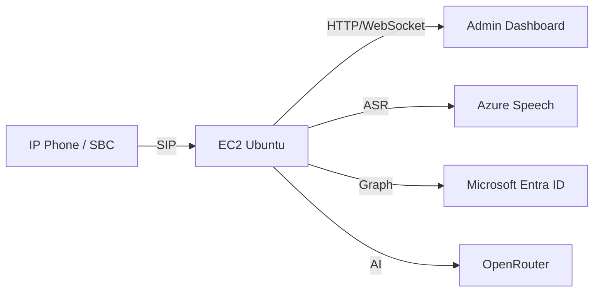
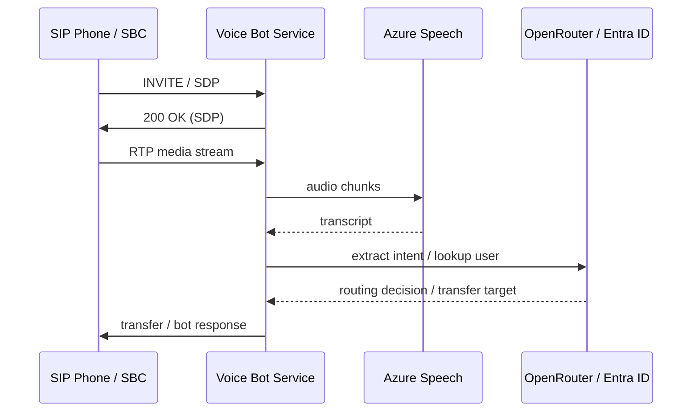

# AWS Installation Guide (ไทย)

## ภาพรวม

โค้ดนี้สามารถติดตั้งบน Amazon EC2 หรือ ECS/Fargate ได้ โดยมี 2 แบบที่เหมาะกับการใช้งานจริง:

1. EC2 Ubuntu 24.04 + PM2 + Nginx
   - เหมาะสำหรับ SIP/RTP และ admin dashboard ที่ต้องเปิดพอร์ตโดยตรง
   - รองรับการใช้งานจริงกับ SBC / SIP trunk

2. ECS/Fargate
   - เหมาะสำหรับแอป HTTP/WebSocket ที่ต้อง scale ขึ้นได้
   - สำหรับ SIP/RTP ที่ต้องมี port เปิดโดยตรง อาจต้องใช้ NLB หรือ EC2 host

สำหรับงาน SIP/RTP ที่มีการรับสายจาก SBC จริง ควรใช้ EC2 หรือ VM ที่มี Public IP และเปิดพอร์ต SIP/RTP ได้โดยตรง

---

## 1. สถาปัตยกรรมแนะนำ



### คำแนะนำสำหรับ AWS

- EC2 instance: Ubuntu 24.04 LTS
- Deploy script: `deploy/aws/aws-deploy.sh`
- Security Group:
  - TCP 22 from your IP
  - TCP 80/443 from Internet
  - TCP 8080 from SBC / your trusted IP
  - UDP 5060 from SBC / trusted network
  - TCP 5061 from SBC / trusted network for SIP/TLS
  - UDP 10000-20000 for RTP (if used)
- Elastic IP: แนะนำใช้เพื่อไม่ให้ IP เปลี่ยนเมื่อ restart
- IAM role: ถ้าต้องใช้ Secrets Manager / SSM สามารถผูกได้

---

## 2. ติดตั้งบน EC2 Ubuntu

### 2.0 Provision EC2 ด้วย AWS CLI

```bash
chmod +x deploy/aws/aws-deploy.sh
./deploy/aws/aws-deploy.sh
```

สคริปต์นี้จะสร้าง key pair, security group, เปิดพอร์ต SIP `5060/UDP`, SIP/TLS `5061/TCP`, RTP `10000-20000/UDP` และ launch EC2 instance ให้พร้อมใช้งานเบื้องต้น

รองรับการ fallback instance type อัตโนมัติ หาก type แรกใช้ไม่ได้ใน region นั้น:

```bash
export INSTANCE_TYPE=t3.small
export INSTANCE_TYPE_FALLBACKS="t3.micro,t4g.small,t4g.micro"
./deploy/aws/aws-deploy.sh
```

### 2.1 อัปเดตเซิร์ฟเวอร์

```bash
sudo apt update && sudo apt upgrade -y
sudo apt install -y curl git nginx ufw nodejs npm build-essential
```

### 2.2 Clone repository

```bash
cd /opt
sudo git clone https://github.com/VichyaS/AI-Bot-VoiceTeam.git
cd AI-Bot-VoiceTeam
sudo npm ci
sudo npm run build:all
```

### 2.3 ตั้งค่า environment variables

```bash
export JWT_SECRET="your-very-long-random-secret-at-least-32-chars"
export ADMIN_USERNAME="superadmin"
export ADMIN_PASSWORD_HASH="$(node -e "console.log(require('bcrypt').hashSync(process.argv[1], 10))" "your-password")"
export CONFIG_openRouterApiKey="your-openrouter-key"
export CONFIG_speechKey="your-speech-key"
export CONFIG_speechRegion="eastasia"
export CONFIG_tenantId="your-tenant"
export CONFIG_clientId="your-client-id"
export CONFIG_clientSecret="your-client-secret"
export PORT=8080
export SIP_PORT=5060
export SIP_TLS_ENABLED=true
export SIP_TLS_PORT=5061
```

> ควรเก็บค่าดังกล่าวไว้ใน Systemd EnvironmentFile หรือ AWS Systems Manager Parameter Store แทนการเก็บในไฟล์ repo

### 2.4 รันด้วย PM2

```bash
sudo npm install -g pm2
pm2 start dist/webhook-server.js --name voice-bot-api --env production
pm2 save
pm2 startup
```

### 2.5 ตั้งค่า Nginx

```bash
sudo tee /etc/nginx/sites-available/voice-bot-api >/dev/null <<'EOF'
server {
  listen 80;
  server_name your-domain.example.com;

  location / {
    proxy_pass http://127.0.0.1:8080;
    proxy_http_version 1.1;
    proxy_set_header Host $host;
    proxy_set_header X-Forwarded-Proto $scheme;
    proxy_set_header X-Forwarded-For $proxy_add_x_forwarded_for;
    proxy_set_header Upgrade $http_upgrade;
    proxy_set_header Connection "upgrade";
  }
}
EOF
sudo ln -s /etc/nginx/sites-available/voice-bot-api /etc/nginx/sites-enabled/
sudo nginx -t
sudo systemctl reload nginx
```

### 2.6 เปิด Firewall

```bash
sudo ufw allow OpenSSH
sudo ufw allow 80/tcp
sudo ufw allow 443/tcp
sudo ufw allow 8080/tcp
sudo ufw allow 5060/udp
sudo ufw allow 5061/tcp
sudo ufw allow 10000:20000/udp
sudo ufw enable
```

---

## 3. Docker deployment (optional)

```bash
docker build -t voice-bot-api .
docker run -d --name voice-bot-api \
  -p 8080:8080 \
  -p 5060:5060/udp \
  -p 5061:5061/tcp \
  -e JWT_SECRET="..." \
  -e ADMIN_USERNAME="superadmin" \
  -e ADMIN_PASSWORD_HASH="..." \
  -e CONFIG_openRouterApiKey="..." \
  -e CONFIG_speechKey="..." \
  -e CONFIG_speechRegion="eastasia" \
  voice-bot-api
```

---

## 4. AWS Security checklist

- ใช้ IAM role แทน Access Key ถ้าเป็นไปได้
- เก็บ secret ใน AWS Secrets Manager / SSM Parameter Store
- เปิด port เฉพาะที่จำเป็น
- เปิด HTTPS ผ่าน ALB/CloudFront หรือ Nginx + Let's Encrypt
- ใช้ `JWT_SECRET` ที่สุ่มและยาวพอ (>32 chars)
- ไม่เปิด `CONFIG_EXPORT_ENABLED=true` เว้นแต่ต้องการ export config จริง
- อย่า commit `config.json`, `users.json`, `.env` ลง GitHub

---

## 5. Call flow สรุป

1. SBC / SIP phone เริ่มต้นเรียกเข้า
2. Server รับ INVITE และสร้าง SDP response
3. RTP audio ถูกส่งกลับไปยัง endpoint ที่ถูกกำหนดจาก SDP/media negotiation
4. Server ส่ง audio เข้า Azure Speech และรับ transcript
5. Server สร้างคำตอบด้วย OpenRouter และส่งคำตอบกลับหาผู้โทร/transfer


