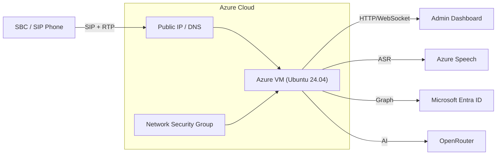
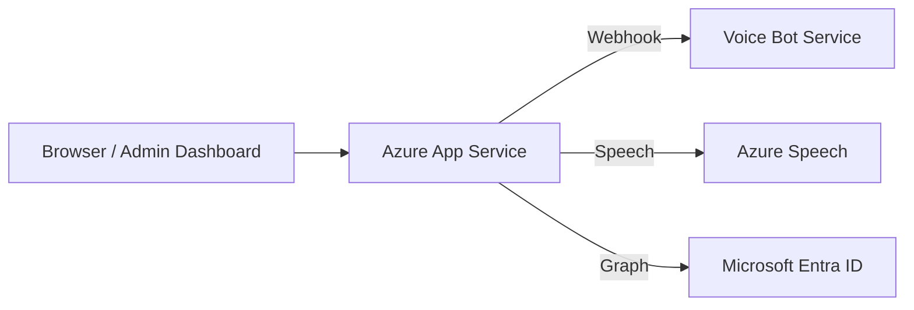
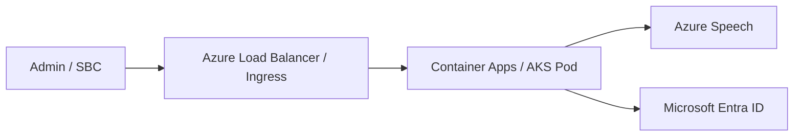

# Azure Installation Guide (ไทย)

## ภาพรวม

แอปนี้สามารถติดตั้งบน Azure ได้ 3 แบบ:

1. Azure VM (Ubuntu) — เหมาะกับ SIP/RTP และ SBC ที่ต้องมี Public IP โดยตรง
2. Azure App Service — เหมาะกับ HTTP/WebSocket รุ่นพื้นฐาน แต่ต้องตรวจสอบ SIP/RTP และ inbound port
3. Azure Container Apps / AKS — เหมาะกับ containerized deployment ที่ต้อง scale ขึ้นได้

สำหรับงานจริงที่ต้องรองรับ SIP/RTP กับ SBC ควรเลือก Azure VM หรือ Azure Container Instance/VM Scale Set ที่มี public IP และ ingress ที่เปิด port UDP/TCP ได้

---

## 1. Azure VM (แนะนำสำหรับ SBC / SIP)

### 1.1 Deploy ด้วย Azure CLI

```bash
chmod +x deploy/azure/azure-deploy.sh
./deploy/azure/azure-deploy.sh
```

ตัวสคริปต์จะสร้าง Resource Group, Ubuntu VM, Public IP และเปิดพอร์ตที่จำเป็นให้โดยอัตโนมัติ

### 1.2 SSH เข้า VM

### 1.1 สถาปัตยกรรม



### 1.2 สร้าง VM

- Resource Group: สร้างใหม่หรือเลือกที่มีอยู่
- Region: Asia Southeast (Singapore) หรือใกล้ SBC/ผู้ใช้มากที่สุด
- Image: Ubuntu 24.04 LTS
- Size: Standard B2s หรือ B2ms ขึ้นไป
- Public IP: สร้าง Static Public IP
- Open ports:
  - 22/TCP
  - 80/TCP
  - 443/TCP
  - 8080/TCP
  - 5060/UDP
  - 10000-20000/UDP

### 1.3 SSH เข้า VM

```bash
ssh azureuser@<PUBLIC_IP>
```

### 1.4 ติดตั้ง Node.js และ dependencies

```bash
sudo apt update
sudo apt install -y curl git nginx ufw nodejs npm build-essential
sudo npm install -g pm2
```

### 1.5 Clone repo และ Build

```bash
cd /opt
sudo git clone https://github.com/VichyaS/AI-Bot-VoiceTeam.git
cd AI-Bot-VoiceTeam
sudo npm ci
sudo npm run build:all
```

### 1.6 ตั้งค่า environment variables

```bash
export PORT=8080
export SIP_PORT=5060
export SIP_TLS_ENABLED=true
export SIP_TLS_PORT=5061
export SIP_TLS_CERT_PATH=/etc/ssl/voicebot/voicebot.crt
export SIP_TLS_KEY_PATH=/etc/ssl/voicebot/voicebot.key
export SRTP_ENABLED=false
export CONFIG_transferProtocol=TLS
export CONFIG_sipDomain="sip:voicebot.example.com"
```

### 1.7 ติดตั้ง TLS certificate สำหรับ HTTPS / SIP/TLS

ดูรายละเอียดเพิ่มเติมที่ [docs/ssl-domain-setup-th.md](ssl-domain-setup-th.md) และ [docs/sbc-config-audiocodes-760-th.md](sbc-config-audiocodes-760-th.md)

```bash
export JWT_SECRET="your-long-random-secret-at-least-32-chars"
export ADMIN_USERNAME="superadmin"
export ADMIN_PASSWORD_HASH="$(node -e "console.log(require('bcrypt').hashSync(process.argv[1], 10))" "your-password")"
export PORT=8080
export SIP_PORT=5060
export CONFIG_openRouterApiKey="your-openrouter-key"
export CONFIG_speechKey="your-speech-key"
export CONFIG_speechRegion="eastasia"
export CONFIG_tenantId="your-tenant"
export CONFIG_clientId="your-client-id"
export CONFIG_clientSecret="your-client-secret"
```

### 1.8 รันด้วย PM2

```bash
pm2 start dist/webhook-server.js --name voice-bot-api --env production
pm2 save
pm2 startup
```

### 1.9 ตั้งค่า Nginx reverse proxy

```bash
sudo tee /etc/nginx/sites-available/voice-bot-api >/dev/null <<'EOF'
server {
  listen 80;
  server_name your-domain.example.com;

  location / {
    proxy_pass http://127.0.0.1:8080;
    proxy_http_version 1.1;
    proxy_set_header Host $host;
    proxy_set_header X-Forwarded-Proto $scheme;
    proxy_set_header X-Forwarded-For $proxy_add_x_forwarded_for;
    proxy_set_header Upgrade $http_upgrade;
    proxy_set_header Connection "upgrade";
  }
}
EOF
sudo ln -s /etc/nginx/sites-available/voice-bot-api /etc/nginx/sites-enabled/
sudo nginx -t
sudo systemctl reload nginx
```

### 1.10 เปิด firewall / NSG

```bash
sudo ufw allow OpenSSH
sudo ufw allow 80/tcp
sudo ufw allow 443/tcp
sudo ufw allow 8080/tcp
sudo ufw allow 5060/udp
sudo ufw allow 10000:20000/udp
sudo ufw enable
```

---

## 2. Azure App Service (HTTP only)

### 2.1 สถาปัตยกรรม



### 2.2 ข้อควรระวัง

- App Service เหมาะสำหรับ HTTP/WebSocket มากกว่า SIP/RTP
- ถ้าใช้กับ SBC จริงและต้องรับ SIP/RTP โดยตรง จะต้องใช้ VM หรือ Azure Container Instance/VMSS ที่มี public IP และ port เปิด

---

## 3. Azure Container Apps / AKS



### แนะนำเมื่อใช้แบบนี้

- เหมาะกับ API/WebSocket ที่ต้อง scale
- SIP/RTP ยังต้องมี ingress / public port ที่ถูกออกแบบไว้เป็นพิเศษ

---

## 4. Azure Security checklist

- เปิดพอร์ต 80/443 สำหรับ HTTPS
- เปิดพอร์ต 5060/5061 สำหรับ SIP signaling
- เปิด RTP range 10000-20000/udp สำหรับ media
- ใช้ TLS certificate ที่มี SAN สำหรับโดเมนจริง
- ถ้าใช้ Azure Firewall / NSG ให้จำกัดแหล่งที่มาให้อยู่ในช่วง SBC / trusted network เท่านั้น
- ใช้ Azure Key Vault สำหรับ secret ที่สำคัญ เช่น OpenRouter, Speech, Entra

- ใช้ Managed Identity เมื่อทำงานกับ Azure resources
- เก็บ secret ใน Azure Key Vault หรือ Environment Variables
- ใช้ NSG เปิดพอร์ตอย่างจำกัด
- ใช้ HTTPS ผ่าน Azure Front Door / Application Gateway / Nginx
- ไม่ commit `config.json`, `users.json`, `.env` ลง repo
