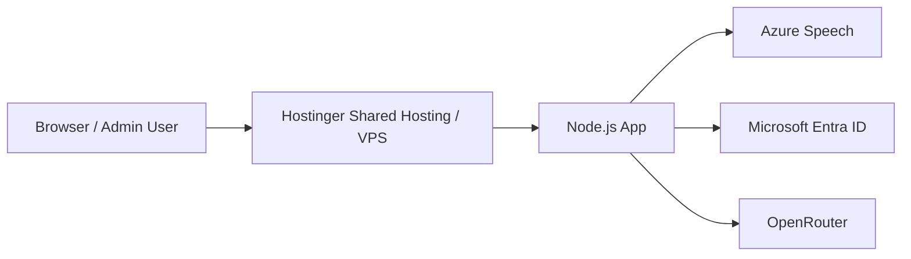
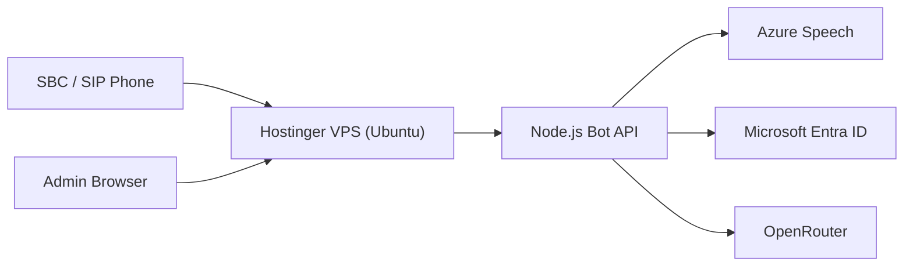
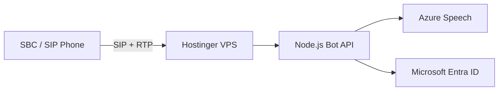

# Hostinger Installation Guide (ไทย)

## ภาพรวม

Hostinger สามารถใช้เป็นจุด deploy อันแรกสำหรับ admin dashboard / webhook API ได้ แต่สำหรับระบบ SIP/RTP ที่ต้องรับสายจริงจาก SBC ควรใช้ VPS หรือ dedicated server มากกว่า shared hosting

### เหมาะกับ Hostinger
- Webhook API
- Admin dashboard
- HTTP/WebSocket service
- Test environment / demo

### ไม่แนะนำสำหรับ Hostinger
- SIP/RTP inbound ที่ต้องเปิด UDP โดยตรงจาก SBC
- High-volume voice traffic
- Production call routing ที่ต้อง latency ต่ำ

---

## 1. สถาปัตยกรรม Hostinger



### คำแนะนำ

- ถ้าใช้ Shared Hosting: เหมาะกับ HTTP/WebSocket เท่านั้น
- ถ้าใช้ VPS (Hostinger VPS): เหมาะกับ Node.js app และ PM2 มากกว่า shared hosting

---

## 2. ถ้าใช้ Hostinger Shared Hosting

### 2.1 เตรียมข้อมูล

- Domain ที่จดไว้
- SSH access (ถ้ามี) หรือ File Manager
- Node.js app deployment ผ่าน Git/SSH/FTP

### 2.2 ขั้นตอน

1. Upload source code ไปยัง public_html หรือ subdomain
2. ติดตั้ง Node.js runtime ถ้าจัดการได้
3. สร้างไฟล์ `.env` หรือ env vars ใน panel ที่รองรับ
4. Run build command ผ่าน SSH terminal หรือ panel ที่มี Node CLI

ตัวอย่าง:

```bash
npm ci
npm run build:all
node dist/webhook-server.js
```

### 2.3 ข้อจำกัดสำคัญ

- Shared hosting นิยมไม่รองรับ SIP/RTP inbound UDP ได้ดี
- Port 5060/UDP และ RTP port range อาจถูกบล็อกหรือไม่อนุญาต
- สำหรับ SBC / SIP จริง ควรย้ายไป VPS หรือ Azure/EC2

---

## 3. ถ้าใช้ Hostinger VPS (แนะนำมากกว่า shared hosting)

### 3.1 สถาปัตยกรรม



### 3.2 ติดตั้งบน VPS

```bash
sudo apt update
sudo apt install -y curl git nginx nodejs npm build-essential
sudo npm install -g pm2
```

### 3.3 Clone และ build

```bash
cd /opt
sudo git clone https://github.com/VichyaS/AI-Bot-VoiceTeam.git
cd AI-Bot-VoiceTeam
sudo npm ci
sudo npm run build:all
```

### 3.4 ตั้งค่า environment variables

```bash
export JWT_SECRET="your-long-random-secret"
export ADMIN_USERNAME="superadmin"
export ADMIN_PASSWORD_HASH="$(node -e "console.log(require('bcrypt').hashSync(process.argv[1], 10))" "your-password")"
export PORT=8080
export SIP_PORT=5060
export CONFIG_openRouterApiKey="your-openrouter-key"
export CONFIG_speechKey="your-speech-key"
export CONFIG_speechRegion="eastasia"
export CONFIG_tenantId="your-tenant"
export CONFIG_clientId="your-client-id"
export CONFIG_clientSecret="your-client-secret"
```

### 3.5 รันด้วย PM2

```bash
pm2 start dist/webhook-server.js --name voice-bot-api --env production
pm2 save
pm2 startup
```

### 3.6 ตั้งค่า Nginx reverse proxy

```bash
sudo tee /etc/nginx/sites-available/voice-bot-api >/dev/null <<'EOF'
server {
  listen 80;
  server_name your-domain.com;

  location / {
    proxy_pass http://127.0.0.1:8080;
    proxy_http_version 1.1;
    proxy_set_header Host $host;
    proxy_set_header X-Forwarded-Proto $scheme;
    proxy_set_header X-Forwarded-For $proxy_add_x_forwarded_for;
    proxy_set_header Upgrade $http_upgrade;
    proxy_set_header Connection "upgrade";
  }
}
EOF
sudo ln -s /etc/nginx/sites-available/voice-bot-api /etc/nginx/sites-enabled/
sudo nginx -t
sudo systemctl reload nginx
```

---

## 4. แนะนำเมื่อใช้ Hostinger กับ SBC / SIP



### หากต้องการใช้ Hostinger จริง ๆ กับ SBC

- เลือก VPS มากกว่า shared hosting
- ติดตั้ง firewall/ufw และปลด port ที่จำเป็น
- หากทำ SIP/RTP อยู่จริง แนะนำให้ใช้ VPS ที่เปิด Public IP และ UDP port ได้อย่างตรงไปตรงมา

---

## 5. Security checklist สำหรับ Hostinger

- ใช้ SSH key แทน password
- ใช้ `JWT_SECRET` ที่ยาวและสุ่ม
- เปิดแค่ port ที่จำเป็น
- ไม่เก็บ `config.json`, `users.json`, `.env` ใน repo
- ถ้าเป็น production ควรใช้ VPS หรือ cloud VM มากกว่า shared hosting
