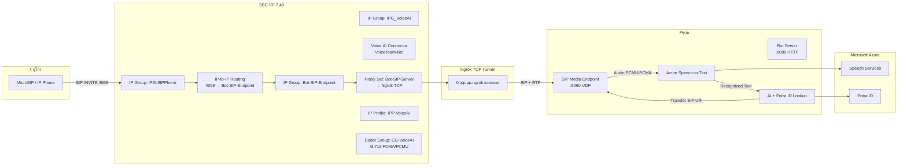

# SBC VE 7.40 Configuration Guide — VoiceTeam Bot

## Architecture



---

## Prerequisites

| รายการ | รายละเอียด |
|---|---|
| SBC Model | AudioCodes Mediant VE / SE v7.40+ |
| License | VoiceAI Connect Basic License |
| Ngrok | Free account + Authtoken (https://dashboard.ngrok.com) |
| Fly.io | App `voiceteam-bot` (https://fly.io) |
| Azure Speech | Speech Services Resource (Key + Region) |

---

## Step 1: Media → Coder Groups

ไปที่ **Media → Coder Groups** → **Add**:

| Field | ค่า |
|---|---|
| **Group Name** | `CG-VoiceAI` |

เพิ่ม Codec:

| Index | Coder Name | Rate |
|---|---|---|
| 1 | `G.711A-law` | 64 |
| 2 | `G.711U-law` | 64 |

---

## Step 2: SIP Behavior → IP Profiles

ไปที่ **SIP Behavior → IP Profiles** → **Add**:

| Field | ค่า |
|---|---|
| **Profile Name** | `IPP-VoiceAI` |
| **Coder Group** | `CG-VoiceAI` |
| **DTMF Transport Type** | `RFC 2833` |
| **Session Expiry (seconds)** | `1800` |
| **100rel (PRACK)** | `Disable` |
| **Early Media** | `Enable` |

---

## Step 3: SIP Behavior → Proxy Sets

ไปที่ **SIP Behavior → Proxy Sets** → **Add**:

| Field | ค่า |
|---|---|
| **Proxy Set Name** | `Bot-SIP-Server` |
| **Proxy Keep-Alive** | `Using OPTIONS` |
| **Proxy Load Balancing Method** | `Priority` |

**Proxy Address → Add:**

| Field | ค่า |
|---|---|
| **Host Name** | `0.tcp.ap.ngrok.io` |
| **Port** | `xxxxx` (ดูจาก Fly.io Log: `flyctl logs -a voiceteam-bot`) |
| **Transport Type** | `TCP` |

---

## Step 4: Proxy Set for Microsoft Teams

ไปที่ **SIP Behavior → Proxy Sets** → **Add**:

| Field | ค่า |
|---|---|
| **Proxy Set Name** | `Microsoft-Teams` |
| **Proxy Keep-Alive** | `Using OPTIONS` |

**Proxy Address → Add:**

| Field | ค่า |
|---|---|
| **Host Name** | `sip.pstnhub.microsoft.com` |
| **Port** | `5061` |
| **Transport Type** | `TLS` |

---

## Step 5: SIP Behavior → IP Groups

### 5.1 IP Group for VoiceAI Bot

ไปที่ **SIP Behavior → IP Groups** → **Add**:

| Field | ค่า |
|---|---|
| **IP Group Name** | `Bot-SIP-Endpoint` |
| **Proxy Set** | `Bot-SIP-Server` |
| **SIP Group Type** | `Server` |
| **Media Realm** | `MR-Voice.AI` |
| **IP Profile** | `IPP-VoiceAI` |

### 5.2 IP Group for VoiceAI Connector (Stub)

ไปที่ **SIP Behavior → IP Groups** → **Add**:

| Field | ค่า |
|---|---|
| **IP Group Name** | `IPG_VoiceAI` |
| **Proxy Set** | `-- None --` |
| **SIP Group Type** | `Server` |
| **Media Realm** | `MR-Voice.AI` |
| **IP Profile** | `IPP-VoiceAI` |

### 5.3 IP Group for Microsoft Teams

ไปที่ **SIP Behavior → IP Groups** → **Add**:

| Field | ค่า |
|---|---|
| **IP Group Name** | `Teams-Direct-Routing` |
| **Proxy Set** | `Microsoft-Teams` |
| **SIP Group Type** | `Server` |
| **Media Realm** | `MR-Voice.AI` |

---

## Step 6: Voice.AI Connectors

ไปที่ **Voice.AI Connectors** → **Add**:

| Field | ค่า |
|---|---|
| **Name** | `VoiceTeam-Bot` |
| **URL** | `wss://voiceteam-bot.fly.dev/api/audiocodes/bot-ws` |
| **Network Interface** | `eth0` |
| **TLS Context** | `default` |
| **Verify Certificate** | `No` |
| **Connect Timeout [sec]** | `5` |
| **Keep-Alive Interval [sec]** | `30` |
| **Send SIP headers** | `No` |

---

## Step 7: SIP Behavior → IP-to-IP Routing

### 7.1 Rule: 4099 → Bot SIP Endpoint

ไปที่ **SIP Behavior → IP-to-IP Routing → Routing SBC** → **Add**:

| Field | ค่า |
|---|---|
| **Rule Name** | `4099-to-Bot` |
| **Source IP Group** | `IPG-SIPPhone` |
| **Destination IP Group** | `Bot-SIP-Endpoint` |
| **Source Username Pattern** | `*` |
| **Destination Username Pattern** | `4099` |
| **Status** | `Enable` |

### 7.2 Rule: Bot Transfer → Teams

ไปที่ **SIP Behavior → IP-to-IP Routing → Routing SBC** → **Add**:

| Field | ค่า |
|---|---|
| **Rule Name** | `Bot-to-Teams` |
| **Source IP Group** | `Bot-SIP-Endpoint` |
| **Destination IP Group** | `Teams-Direct-Routing` |
| **Source Username Pattern** | `*` |
| **Destination Username Pattern** | `*` |
| **Status** | `Enable` |

---

## Step 8: Media → Media Realms

ไปที่ **Media → Media Realms** → **Add** (ถ้ายังไม่มี):

| Field | ค่า |
|---|---|
| **Realm Name** | `MR-Voice.AI` |
| **IPv4 Interface** | เลือก Interface LAN |
| **Port Range Start** | `60000` |
| **Port Range End** | `64000` |

---

## Step 9: Save & Reset

1. กด **Save** (ไอคอนฟลอปปี้) ที่มุมบนขวา
2. ไปที่ **Maintenance → Software Update → Reset**
3. เลือก **Burn to FLASH + Reset**
4. รอ SBC รีสตาร์ท (~3 นาที)

---

## Troubleshooting

### Status: "Not Connected"

```bash
# 1. ตรวจสอบว่า Fly.io ทำงาน
curl https://voiceteam-bot.fly.dev/api/health

# 2. ตรวจสอบ Ngrok URL
flyctl logs -a voiceteam-bot
# หา: [tunnel] ✅ TCP tunnel: 0.tcp.ap.ngrok.io:xxxxx
```

### Route Failed! IPGroup 4 is not alive

สาเหตุ: IP Group `IPG_VoiceAI` หรือ `Bot-SIP-Endpoint` ไม่มี Proxy Set ที่ถูกต้อง

**แก้:** ตรวจสอบว่า `Bot-SIP-Endpoint` มี Proxy Set = `Bot-SIP-Server` และ Host/Port ถูกต้อง

### SIP 500 Server Internal Error

สาเหตุ: SBC ไม่สามารถส่ง SIP ไปยัง Bot ได้

**แก้:** ตรวจสอบ Ngrok TCP tunnel ว่า port ยังตรงกับที่ตั้งค่าใน SBC

---

## คำสั่ง Fly.io ที่ใช้บ่อย

```bash
# ดู Log
flyctl logs -a voiceteam-bot

# ตั้งค่า Secrets
flyctl secrets set KEY=VALUE -a voiceteam-bot

# Deploy ใหม่
flyctl deploy -a voiceteam-bot --remote-only

# เปิด Dashboard
flyctl open -a voiceteam-bot
```